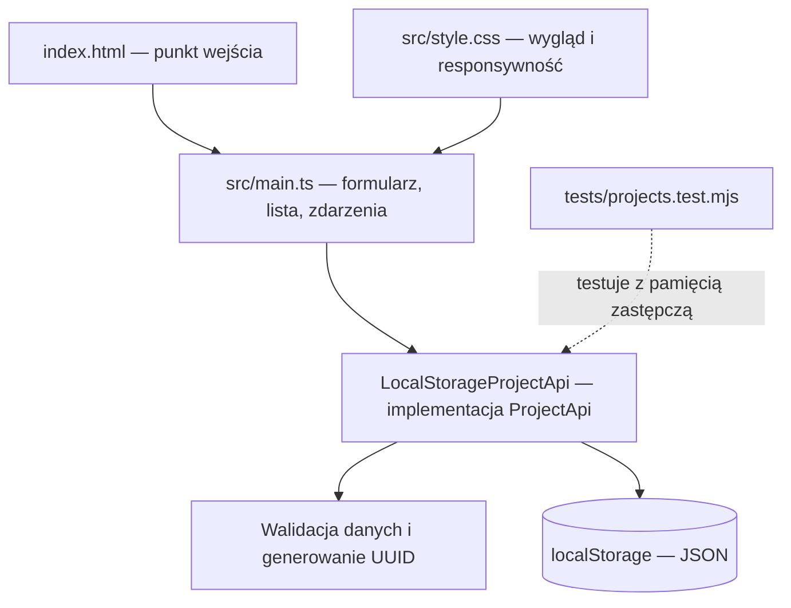

# ManageMe — starter

Aplikacja do zarządzania projektami: Vite + TypeScript, bez frameworka.

## Uruchomienie

Wymagane: Node.js zgodny z Vite (22.12+ lub 20.19+), npm oraz Git.
Projekt sprawdzono na Node.js 22.12.0. Nie potrzebujesz serwera bazy danych,
konta w chmurze ani pliku `.env`.

### Pierwsze uruchomienie

Repozytorium jest prywatne — klonowanie wymaga dostępu do niego na GitHubie.

```bash
git clone https://github.com/ando7555/manageme.git
cd manageme
npm ci
npm run dev
```

Jeżeli masz już projekt lokalnie, otwórz terminal w jego katalogu i wykonaj
tylko `npm ci` oraz `npm run dev`.

Otwórz adres podany w terminalu przez Vite, zwykle `http://localhost:5173`.
Jeśli port jest zajęty, Vite wybierze kolejny. Zmiany w kodzie odświeżają
aplikację automatycznie. Aby zatrzymać serwer, naciśnij `Ctrl+C` w terminalu.

### Dostępne polecenia

| Polecenie | Działanie |
| --- | --- |
| `npm ci` | Instaluje zależności według `package-lock.json`. |
| `npm run dev` | Uruchamia serwer deweloperski Vite. |
| `npm run build` | Sprawdza TypeScript i tworzy wersję produkcyjną w `dist/`. |
| `npm run preview` | Udostępnia wcześniej zbudowane `dist/`, zwykle na `http://localhost:4173`. |
| `npm test` | Uruchamia testy warstwy danych w Node.js. |

Aby sprawdzić wersję produkcyjną lokalnie:

```bash
npm run build
npm run preview
```

`preview` służy do lokalnego sprawdzenia kompilacji. Katalog `dist/` można
następnie opublikować na hostingu stron statycznych.

## Funkcje

- Tworzenie, odczyt, edycja i usuwanie projektów.
- Model: id (UUID), nazwa, opis.
- Wyszukiwanie po nazwie i opisie, potwierdzenie usuwania.
- Walidacja: nazwa 1–100 znaków po przycięciu spacji, opis do 2000 znaków.
- Responsywny interfejs w języku polskim.

## Architektura projektu

Aplikacja działa w przeglądarce, używa TypeScript i bezpośrednio aktualizuje DOM.
Vite obsługuje uruchomienie i budowanie projektu. Obecnie nie ma backendu
ani żądań HTTP do API — rolę magazynu danych pełni localStorage.



### Struktura plików

```text
manageme/
├── index.html              # Dokument HTML, ładuje src/main.ts
├── src/
│   ├── main.ts             # Widoki, stan edycji, wyszukiwanie, obsługa CRUD
│   ├── projects.ts         # Model, kontrakt API i implementacja localStorage
│   └── style.css           # Style aplikacji i układ mobilny
├── tests/
│   └── projects.test.mjs    # Testy CRUD, walidacji i błędów pamięci
├── package.json            # Zależności i polecenia npm
├── package-lock.json       # Zablokowane wersje zależności
├── tsconfig.json           # Konfiguracja TypeScript w trybie strict
├── .gitignore              # Wyklucza m.in. node_modules/ i dist/
└── README.md
```

`node_modules/` powstaje po instalacji, a `dist/` po kompilacji.
Oba katalogi są generowane i nie trafiają do repozytorium.

### Model i kontrakt API

```ts
interface Project {
  id: string     // UUID generowany podczas tworzenia
  nazwa: string  // Wymagana nazwa
  opis: string   // Opis, może być pusty
}

type ProjectInput = Omit<Project, 'id'>
```

| Metoda `ProjectApi` | Wynik | Zastosowanie |
| --- | --- | --- |
| `list()` | `Promise<Project[]>` | Odczyt wszystkich projektów. |
| `get(id)` | `Promise<Project \| undefined>` | Odczyt pojedynczego projektu. |
| `create(input)` | `Promise<Project>` | Walidacja, nadanie UUID i zapis. |
| `update(id, input)` | `Promise<Project>` | Aktualizacja z zachowaniem ID. |
| `delete(id)` | `Promise<void>` | Usunięcie projektu. |

### Przepływ danych

1. Użytkownik wysyła formularz w `src/main.ts`.
2. UI wywołuje `create` lub `update` w `LocalStorageProjectApi`.
3. Klasa waliduje dane, odczytuje tablicę projektów i zapisuje jej nową wersję jako JSON.
4. Po udanym zapisie UI pobiera listę przez `list()` i ponownie renderuje karty.
5. Błędy trafiają do komunikatu na stronie; nieudany zapis nie czyści formularza.

Wyszukiwanie filtruje listę w UI. Usunięcie wymaga potwierdzenia w oknie dialogowym.
Tekst projektu jest renderowany przez `textContent`, więc nie jest interpretowany jako HTML.

### Warstwa danych i przyszłe API

src/projects.ts zawiera interfejs ProjectApi i implementację LocalStorageProjectApi.
Metody list, get, create, update i delete zwracają Promise. Aby przejść na
NoSQL, dodaj implementację tego interfejsu komunikującą się z API i podmień
instancję w src/main.ts. Interfejs użytkownika nie korzysta bezpośrednio z localStorage.

Dane są przechowywane pod kluczem manageme.projects.v1, wyłącznie w bieżącej
przeglądarce i dla bieżącego originu. Wyczyszczenie danych przeglądarki usuwa projekty.
Uszkodzone dane nie są automatycznie nadpisywane. Błędy dostępu i zapełnienia
pamięci są wyświetlane użytkownikowi. Zmiany z innych kart odświeżają listę;
jednoczesne zapisy z wielu kart nie mają gwarancji transakcyjności.

## Sprawdzenie ręczne

1. Dodaj projekt, odśwież stronę i sprawdź zapis.
2. Edytuj nazwę i opis, zapisz, sprawdź wyszukiwanie.
3. Anuluj usuwanie, następnie potwierdź usunięcie.
4. Sprawdź pustą nazwę, widok mobilny oraz obsługę klawiaturą.
